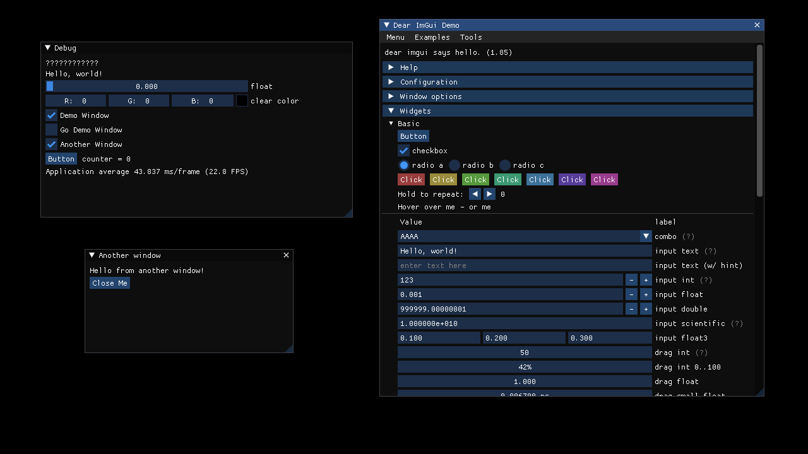

# Dear ImGui for Go

[](https://pkg.go.dev/github.com/inkyblackness/imgui-go/v2)
[](https://goreportcard.com/report/github.com/inkyblackness/imgui-go)
[](https://github.com/inkyblackness/imgui-go/actions)

This library is a [Go](https://www.golang.org) wrapper for **[Dear ImGui](https://github.com/ocornut/imgui)**.

This wrapper started as a special-purpose wrapper for use within InkyBlackness.
However, it is self-contained and can be used for other purposes as well.

This wrapper is
* hand-crafted, for Go
* documented
* versioned
* with ported examples in a separate repository (see below)



## API naming

Names of types and functions follow closely those of **Dear ImGui**.

For functions that have optional parameters, the following schema is applied:
* There is the "verbose" variant, followed by the letter `V`, such as `ButtonV(id string, size Vec2) bool`
* Next to it there is the "idiomatic" variant, without any optional parameter, such as `Button(id string) bool`.
* The idiomatic variant calls the verbose variant with the default values for the optional parameters.
Functions that don't have optional parameters don't come in a verbose variant.

The **Dear ImGui** functions `IO()` and `Style()` have been renamed to be `CurrentIO()` and `CurrentStyle()`.
This was done because their returned types have the same name, causing a name clash.
With the `Current` prefix, they also better describe what they return.  

## API philosophy
This library does not intend to export all the functions of the wrapped **Dear ImGui**. The following filter applies as a rule of thumb:
* Functions marked as "obsolete" are not available. (The corresponding C code isn't even compiled - disabled by define)
* "Shortcut" Functions, which combine language features and/or other **Dear ImGui** functions, are not available. Prime example are the Text*() functions for instance: Text formatting should be done with fmt.Sprintf(), and style formatting with the corresponding Push/Pop functions.
* Functions that are not needed by InkyBlackness are ignored. This doesn't mean that they can't be in the wrapper, they are simply not a priority. Feel free to propose an implementation or make a pull request, respecting the previous points :)

## Version philosophy
This library does not mirror the versions of the wrapped **Dear ImGui**. The semantic versioning of this wrapper is defined as:
* Major changes: (Breaking) changes in API or behaviour. Typically done through changes in **Dear ImGui**.
* Minor changes: Extensions in API. Typically done through small version increments of **Dear ImGui** and/or exposing further features in a compatible way.
* Patch changes: Bug fixes - either in the wrapper or the wrapped **Dear ImGui**, given that the API & behaviour remains the same.

At the moment, this library uses version [1.76](https://github.com/ocornut/imgui/releases/tag/v1.76) of **Dear ImGui**.

## Examples
A separate repository was created to host ported examples and reference implementations.
See repository [inkyblackness/imgui-go-examples](https://github.com/inkyblackness/imgui-go-examples).

It contains reference implementations for libraries such as [GLFW3](https://github.com/go-gl/glfw) and [SDL2](https://github.com/veandco/go-sdl2), using [OpenGL](https://github.com/go-gl/gl).

The screenshot above was created with such an example.

## Extras

### FreeType font rendering

If the `FreeType` library is available for your platform, you can enable using it with the build tag `imguifreetype` - as in
```
go build -tags="imguifreetype"
```
This extra is based on the reference implementation from **Dear ImGui**.

This allows you to use the function `FontAtlas.BuildWithFreeType()`. If the build tag is not set, this function will always return an error. 

If you set the build tag, yet the corresponding support has not been added to the library, you will receive a build error.
Contributions to support more build environments are happily accepted. See files `FreeTypeEnabled*.go`.

> If you are trying to do this on MS Windows with MinGW and receive an error like
> `pkg-config: exec: "pkg-config": executable file not found in %PATH%`,
> refer to [online guides](https://stackoverflow.com/questions/1710922/how-to-install-pkg-config-in-windows) on how to add this to your installation.  

## Alternatives

Before this project was created, the following alternatives were considered - and ignored:
* `kdrag0n/go-imgui` (no longer available). Reasons for dismissal at time of decision:
  * Auto-generated bloat, which doesn't help
  * Was using old API (1.5x)
  * Did not compile
  * Project appeared to be abandoned
* [Extrawurst/cimgui](https://github.com/Extrawurst/cimgui). Reasons for dismissal at time of decision:
  * Was using old API (1.5x), 1.6x was attempted
  * Apparently semi-exposed the C++ API, especially through the structures
  * Adding this adds another dependency
  * Note: `cimgui` has since switched to an auto-generated method. You can use that instead of this manually curated wrapper here.


## License

The project is available under the terms of the **New BSD License** (see LICENSE file).
The licenses of included sources are stored in the **_licenses** folder.
