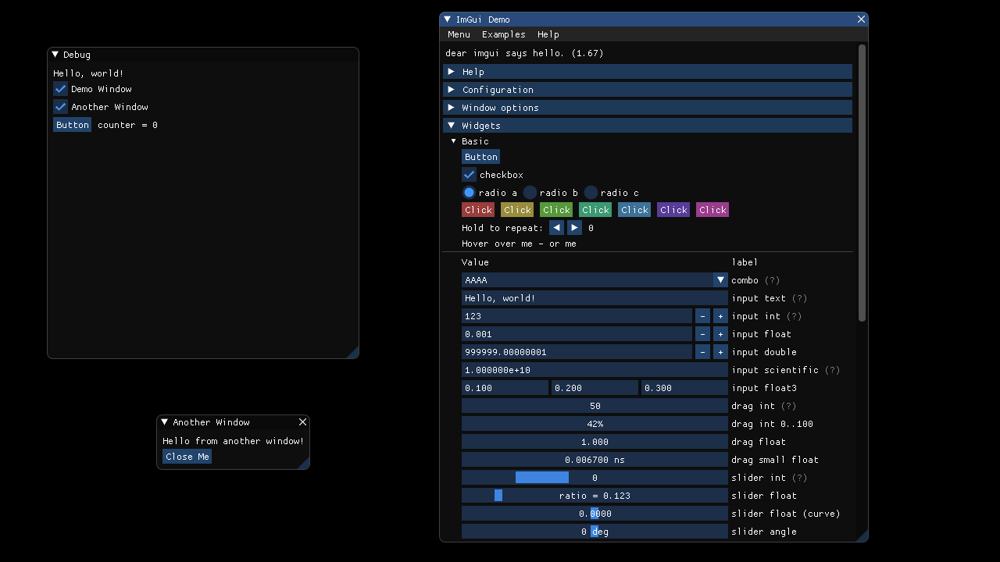

## OpenGL 2 Example

This example is based on SDL2 using [veandco/go-sdl2](https://github.com/veandco/go-sdl2).



### Starting

To start the example, run the following commands from within this directory:

```
go get -u .
go run main.go imgui-go_impl_sdl2_gl2.go
```

The first command ensures all dependencies are available, the second runs the application.
