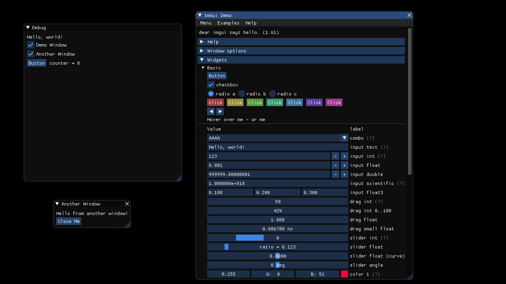

## OpenGL 3 Example

This example is based on GLFW using [go-gl/glfw](https://github.com/go-gl/glfw).



### Starting

To start the example, run the following commands from within this directory:

```
go get -u .
go run main.go imgui-go_impl_glfw_gl3.go
```

The first command ensures all dependencies are available, the second runs the application.
